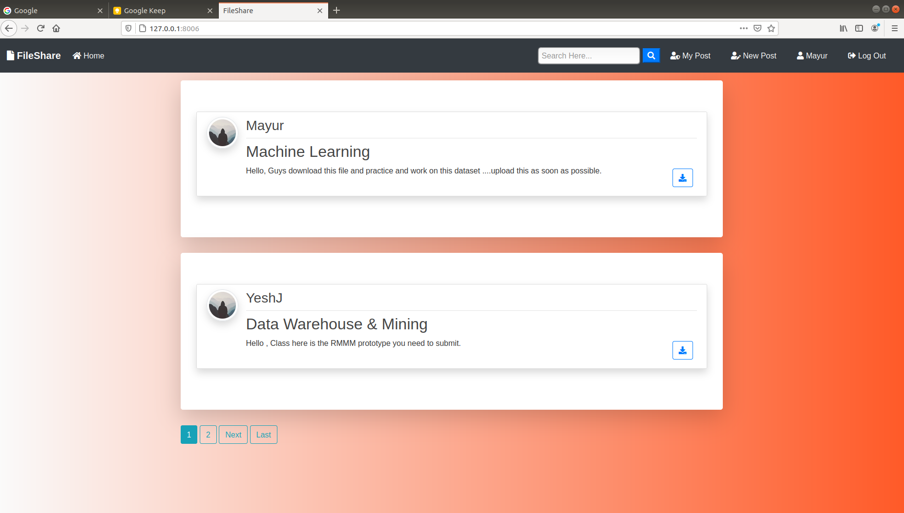
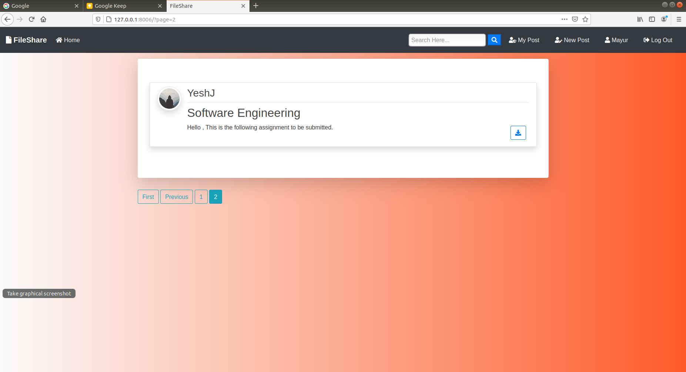
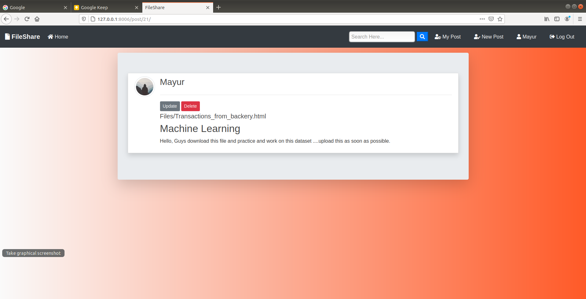
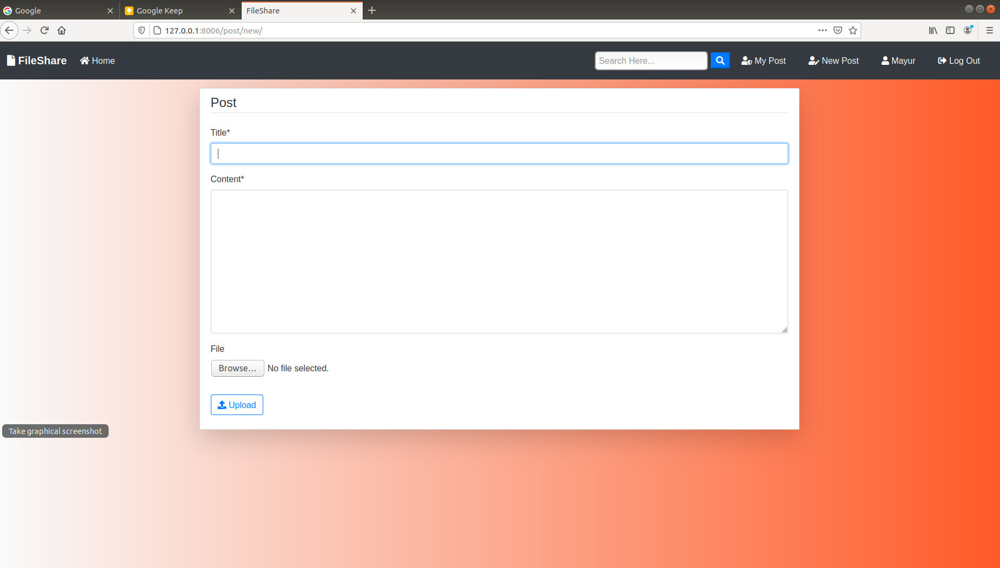
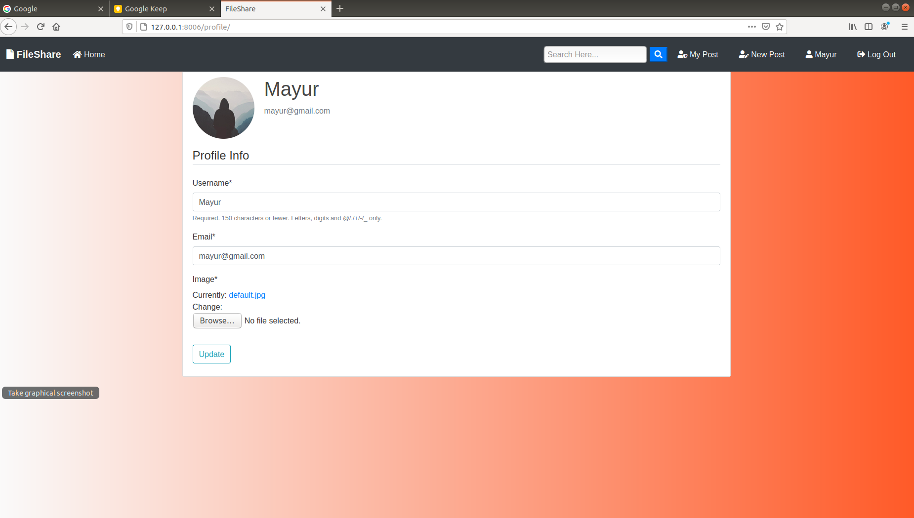
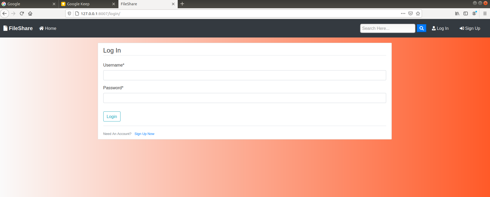
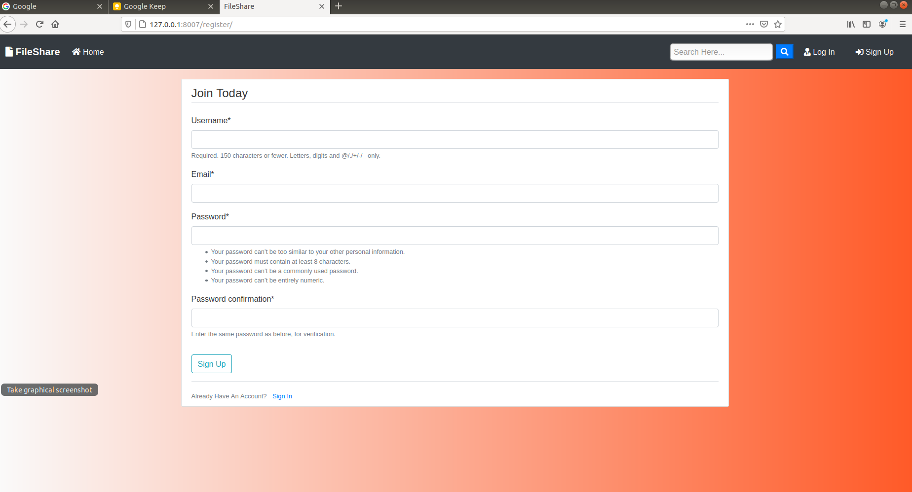

# FileShare

This app is for users to easily share files with each other.

<h2>Features:</h2>
<ul>
    <li>A user can login.</li>
    <li>User can upload files.</li>
    <li>User can view his/her uploaded files.</li>     
    <li>It is mobile responsive.</li>
    <li>User can search and view profile of other users.</li>
    <li>They can share their uploaded files with any of those users.</li>
    <li>Users can see the shared files by other users also in uploaded files.</li>
</ul>

<h4>Additional Features:</h4>
<ol>
    <li>In users profile user can set his/her profile picture.</li>
    <li>Users can download other users' uploaded files.</li>
    <li>The user can upload any type of files such as images, videos, text files and also different types of programs like python code, java code, etc.</li>
</ol>
    
<h2>Technologies Used:</h2>
<ul>
    <li>Python</li>
    <li>Django</li>
    <li>Bootstrap</li>
    <li>JavaScript</li>
</ul>
    
<h2>Install this modules before running on your local:</h2>
<ul>
    <li>Django</li>
    <li>django-crispy-forms</li>
    <li>Pillow</li>
</ul>

<h2>Steps:</h2>
    Downlaod and unizp this folder
    In your terminal open this directory
    This is to create your environment
    Install independently requirements.txt modules or directly run it.
    
    source my_env/bin/activate
    
    python django_web_app/manage.py makemigrations

    python django_web_app/manage.py migrate

    python django_web_app/manage.py runserver
    
   In your web browser enter the address : http://localhost:8000 or http://127.0.0.1:8000/

   
# Screenshots : 

